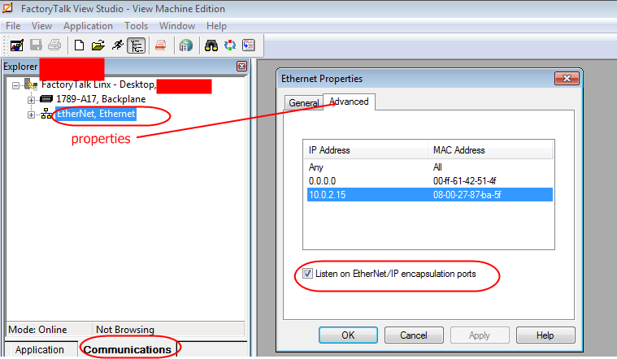
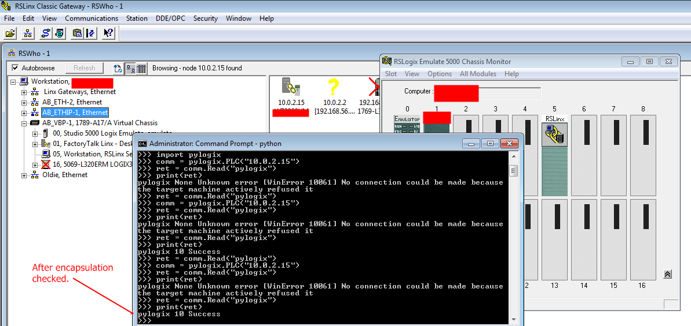

# Communicating with Emulate

It is possible to communicate with RSEmulate using pylogix. You must be running pylogix on the computer that is running Emulate. If you receive the response ***Unknown error [WinError 10061]No connection could be made because the target machine actively refused it*** there are additional steps you may need to take. RSLinx Enterprise has an option to "Listen on Ethernet I/P encapsulation ports" that needs to be turned on. The easiest way for me was to do it
through FactoryTalk View Studio ME, though there may be other ways to enable this feature:

 

* From FTVSME, go to the very bottom of the Explorer, switch to the Communication tab
* Right click on the Ethernet driver, select Properties
* Switch to the Advanced tab
* Check the Encapsulation check box

 

 
  
 

