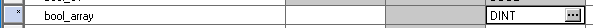
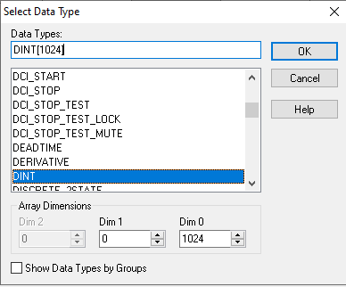
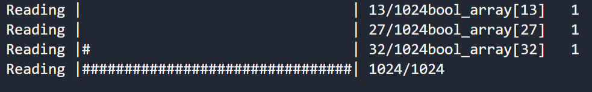
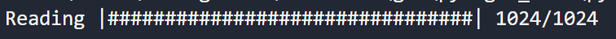

# Progress Bar

Occasionally you will have a long operation, and it is useful to show the user a progress bar. Below is that implementation is very easy to add a bar to a loop, not so much on functions that return a list because there is no internal counter, such functions like MultiRead, or GetTagList.

[Progress Library](https://pypi.org/project/progress/)

## Create array tag of 1024 in RSlogix 5000

Create a new controller tag `bool_array`, click on the three dots. Type 1024 in Dim 0, on in the top bar as shown below.





Expand array and set some values to 1, 5 or so.

## Python Code

Import Bar:

```python
from progress.bar import Bar
```

Declare vars:

```python
bool_array = [None] * 1024
bar = Bar('Reading', max=len(bool_array))
```

Initialize tag array, without having to manually write bool_array[0], bool_array[1]...

```python
for index in range(len(bool_array)):
    bool_array[index] = "bool_array[%d]" % (index)
```

Add Bar code:

```python
for tag in bool_array:
    value = read_tag(tag)
    if value == 1:  # comment out to see one progress bar
        print(tag, " ", value)  # comment out to see one progress bar
    bar.next()
bar.finish()
```

## Run progress_bar.py

Note that because we have an if statement inside the loop we get some funky results.



Comment out the if statement, and run script again.


